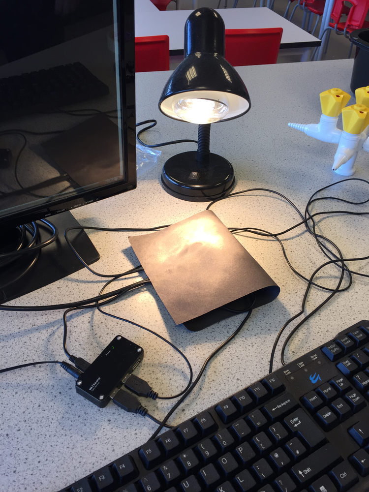
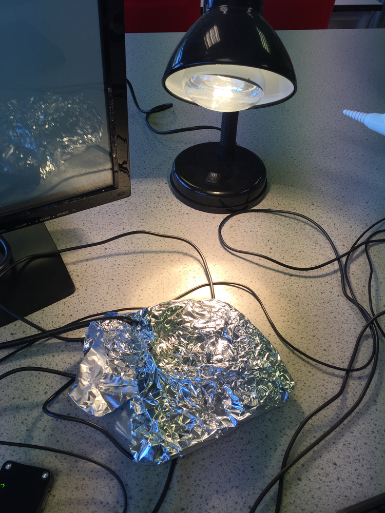

#Black and Silver cans (absorption of IR)

In this lesson students will investigate how different coloured surfaces affect the absorption of IR

##Learning objectives

- Understand that absorption of IR causes objects to become hot 
- Understand that different materials absorb different amounts of IR radiations 
 

##All students are able to

- Measure the temperature of black and silver objects 
- Identify that absorption of IR causes heating of objects

##Most students are able to

- Collect temperature results for different surfaces
- Identify which surfaces are the best at absorbing IR
- Plot a graph of absorption against time

##Some students are able to

- Explain which surface is the best at absorbing IR 
- Explain how different surfaces can be used in real life applications

##Lesson Summary

- Students will set up the Sense HAT to record temperatures 
- Students will record temperatures of silver and black objects
- Students will plot a scatter graph of their results

##Starter

- Ask students which colour t-shirt they should wear on a hot day? Students may say that the darker colour attracts more heat that shiny surfaces. Challenge students to use the correct terminology (for example, "absorb" rather than "attract")

##The Data Logger

- To access the resources for this investigation, open a LXTerminal and type `sudo python3 cans.py`

##Measuring 

1. Explain to students that the Sense HAT contains sensors that can measure temperature

1. Setup the apparatus to measure the temperature of the Sense HAT as a light is shone onto it. It is important to use a filament bulb rather than an energy saving bulb. It is also possible to use other sources of heat, although in this case a risk assessment should be performed prior to starting the experiment.

##Carrying out the experiment

1. Wrap a Raspberry Pi and Sense HAT in black paper.

 
 
1. Place the table lamp on a heat-proof mat and position a table lamp 30cm away from it.
1. Start the code and enter a suitable filename for the results.
1. Enter the number of results required and the interval between each measurement.
1. Switch on the table lamp and press enter on the keyboard (or the button on the Sense HAT)
1. Once the results have been collected they will be written to a file which can be analyzed.
1. Replace the black paper with silver foil and repeat the steps above.
 

##Analysis of the results

- Once the results have been saved the file can be accessed by importing into a spreadsheet or by printing out the raw data file.
- Students to plot a graph of the temperature against time for the black and silver can.

##Plenary

- Ask students to identify which material became hot the quickest.
- What does this tell us about the absorption of IR radiation?

##Extension

- Once the Raspberry Pi and Sense HAT has warmed up, it will cool down once the light is switched off. If the experiment is repeated without the light on, a measurement of the emission of IR can be determined. 

##Risk assessment

In addition to the points below a full risk assessment should be carried out by institution using this experiment.

- The heating of paper with the filament lamp can potentially cause a fire risk
- Once the experiment is over switch the lamp off to remove the heat source from the Raspberry Pi
- The lamp should be kept a minimum of 30cm from the Raspberry Pi
- When wrapping the Sense HAT and Raspberry Pi in silver foil, it is important to prevent a short circuit by first wrapping the Pi in a non-conductive material such as clingfilm.
