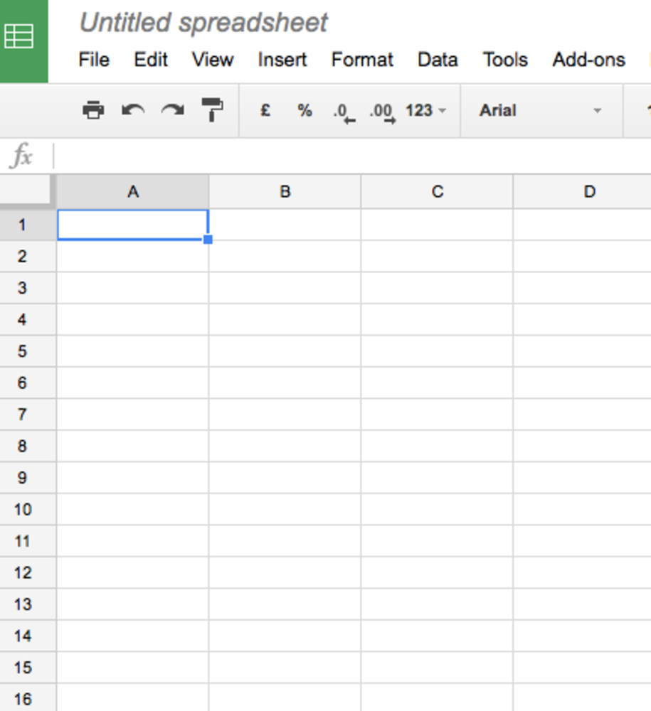
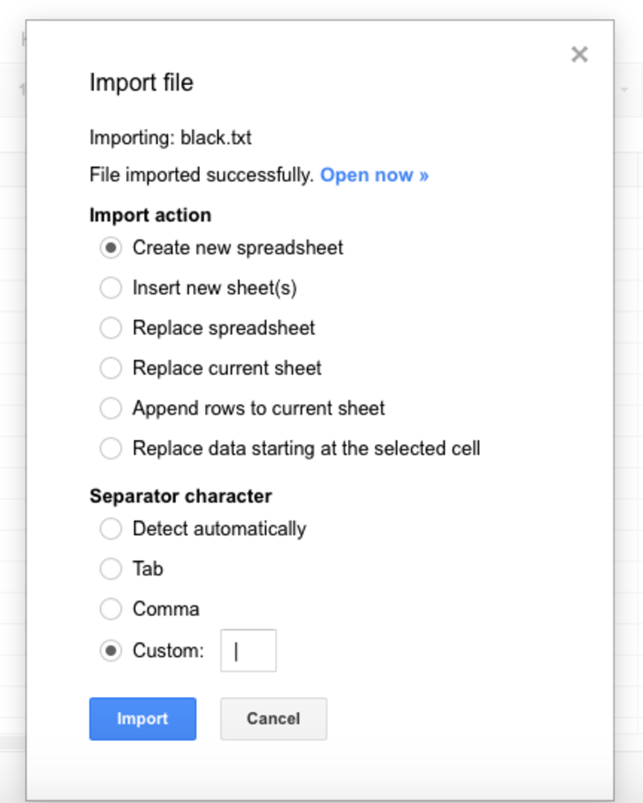
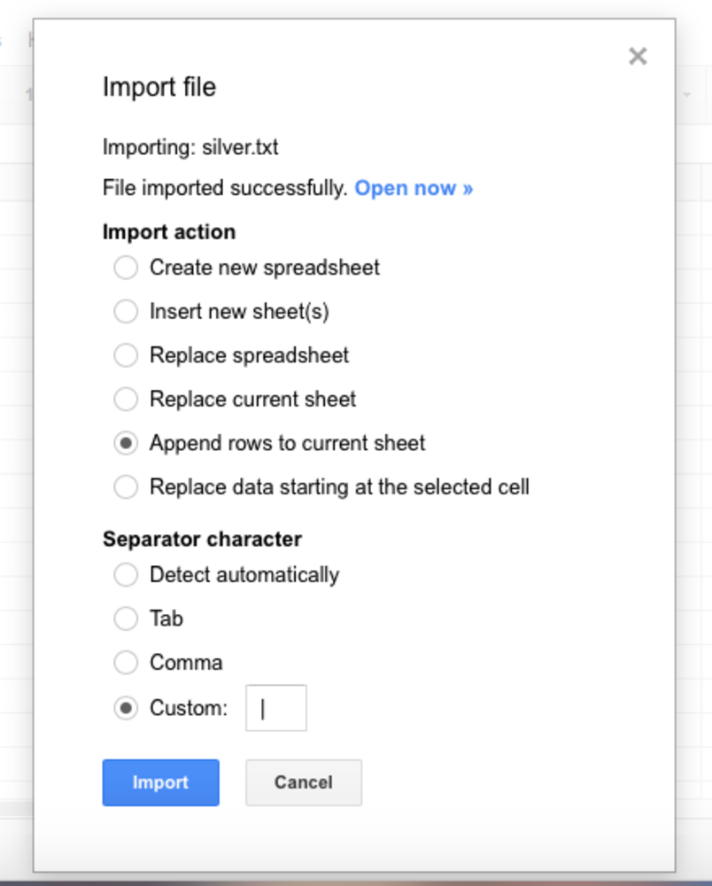
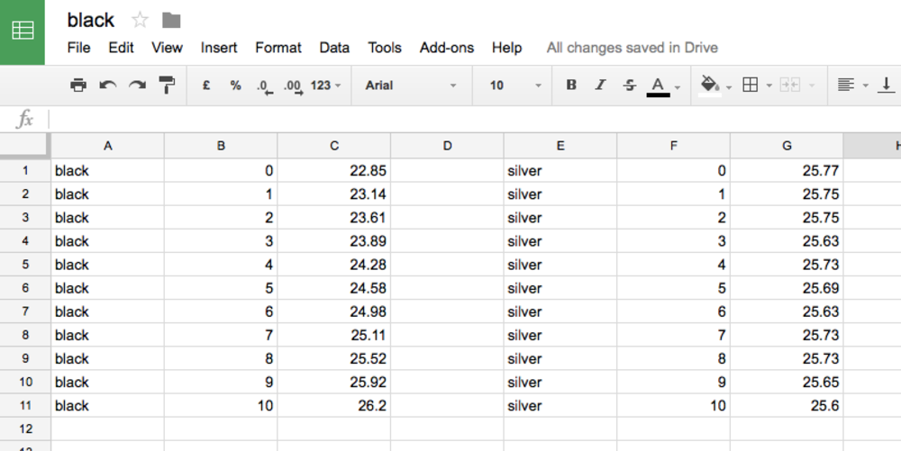
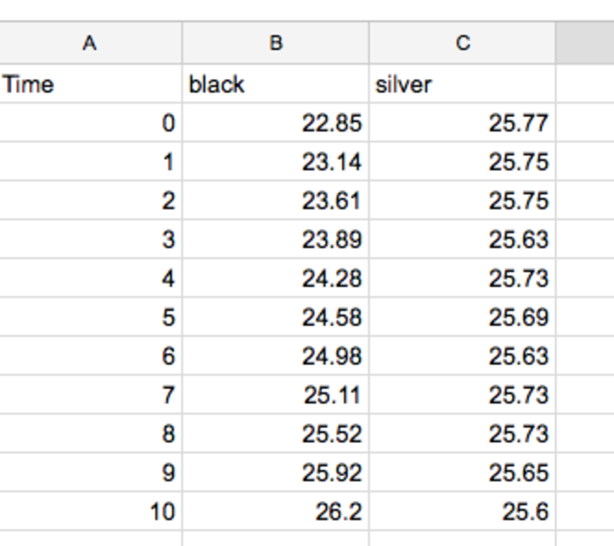
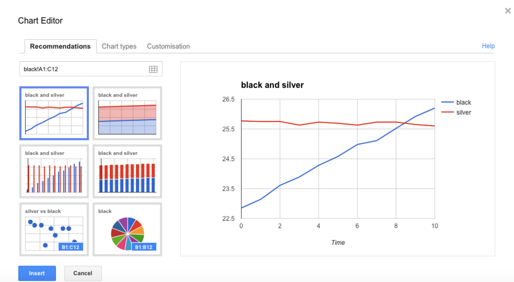
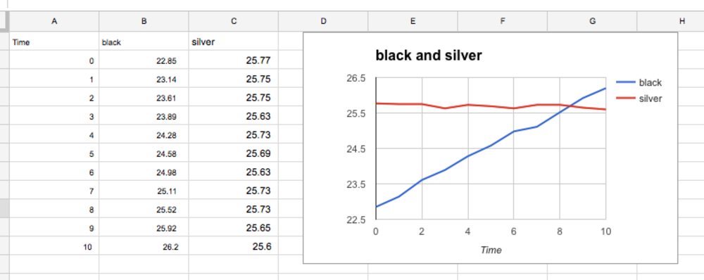

# Investigating absorption of IR by different coloured surfaces

In this lesson you are going to investigate how the colour of a surface affects its absorption of IR radiation.

## Theory 

Different coloured surfaces absorb different amounts of IR radiation. During this practical we will find out which surface colour absorbs the most radiation.

## Experiment  

1. Wrap a Raspberry Pi and Sense HAT in black paper.
1. Place the Raspberry Pi on a heat-proof mat and position a table lamp 30cm away from it.
1. Start the code and enter a suitable filename for the results.
1. Enter the number of results required and the interval between each measurement.
1. Switch on the table lamp and press Enter on the keyboard (or the button on the Sense HAT).
1. Once the results have been collected they will be written to a file which can be analysed.
1. Replace the black paper with silver foil and repeat the steps above.

## Extension

Using a suitable spreadsheet, import both sets of data and produce a line graph comparing both sets of results.  

- Log into Google Sheets and start a new sheet:

  

- Import the first set of results. The pipe symbol `|` has been used to separate each column of results.:

  

- Import the second set of results and use the pipe symbol again to separate each column of results. This time, append the rows to the current sheet:

  

- You will now have two sets of results on the same sheet. Copy and paste the second set of results, tidy up the column headings, and remove rows no longer needed:

  
  
  

- Highlight both sets of results and the time, and select New Chart:

- You will now have a finished chart which you can use to write a conclusion, identifying which material warmed up the quickest and was the best at absorbing IR radiation:

