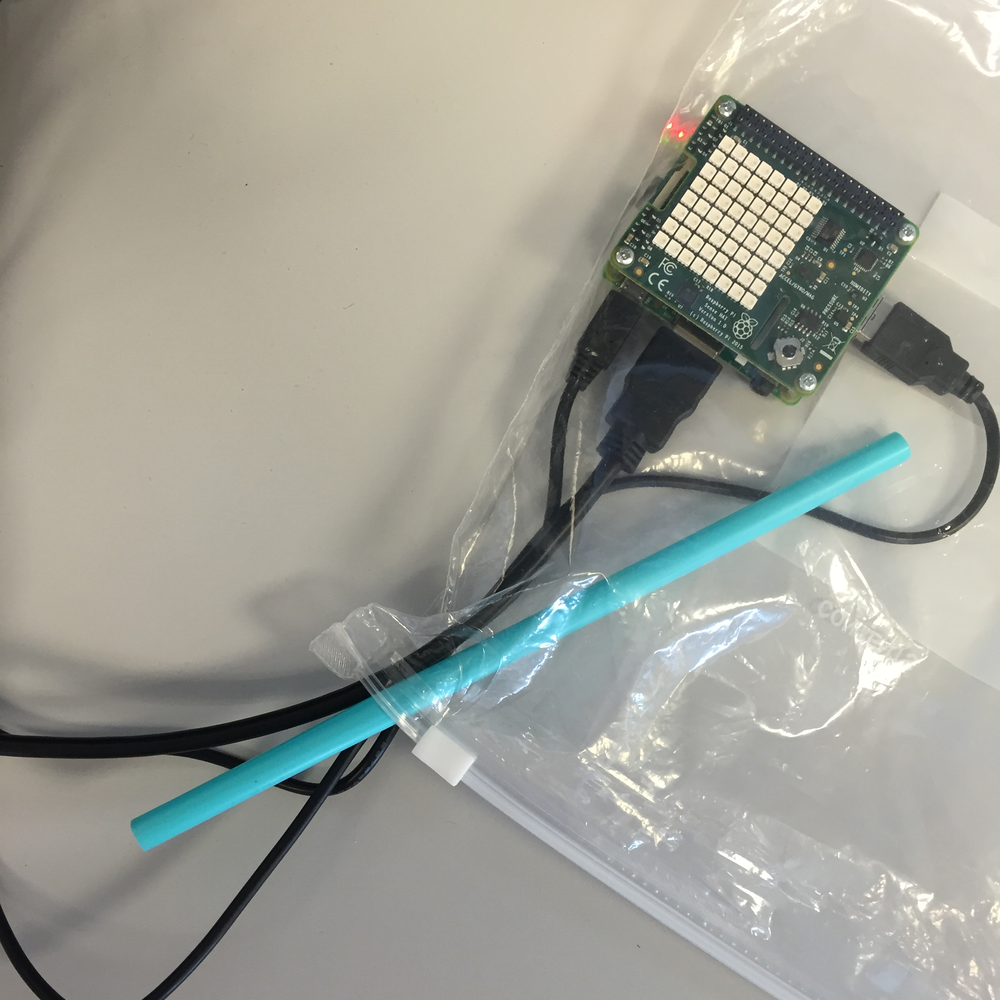
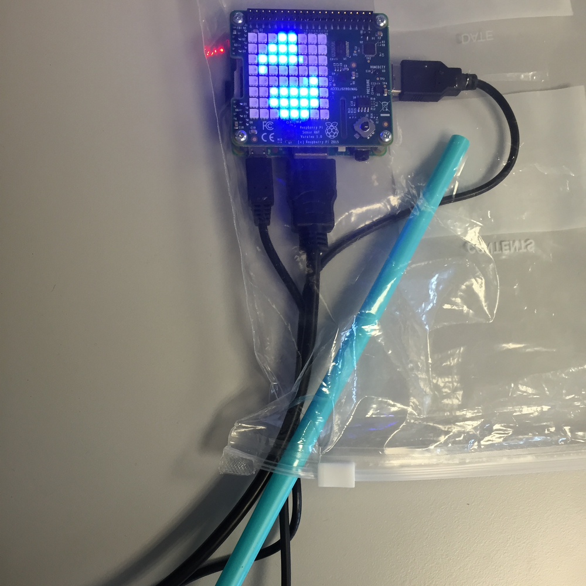
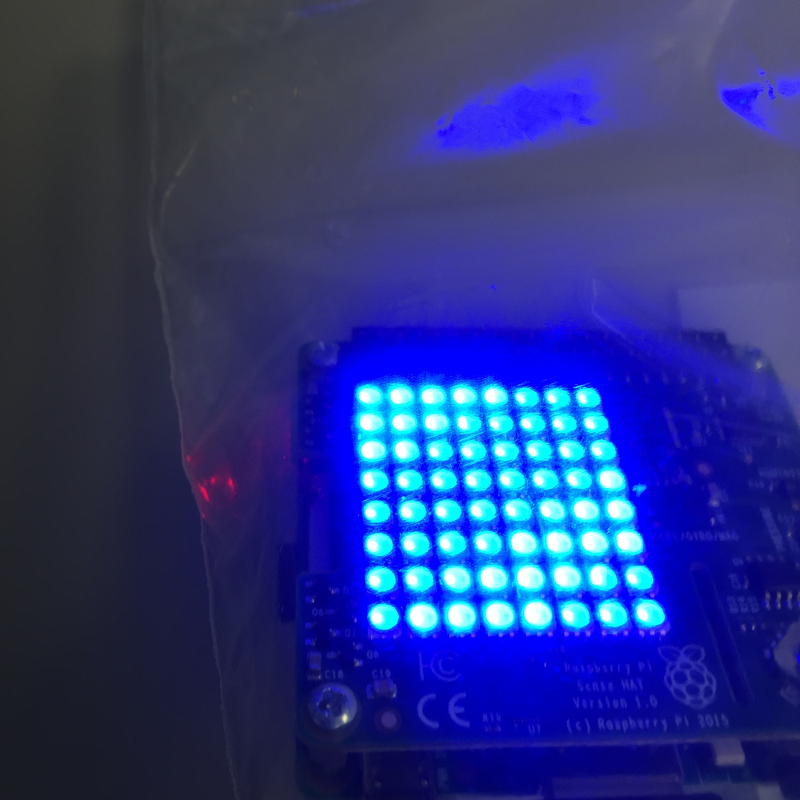
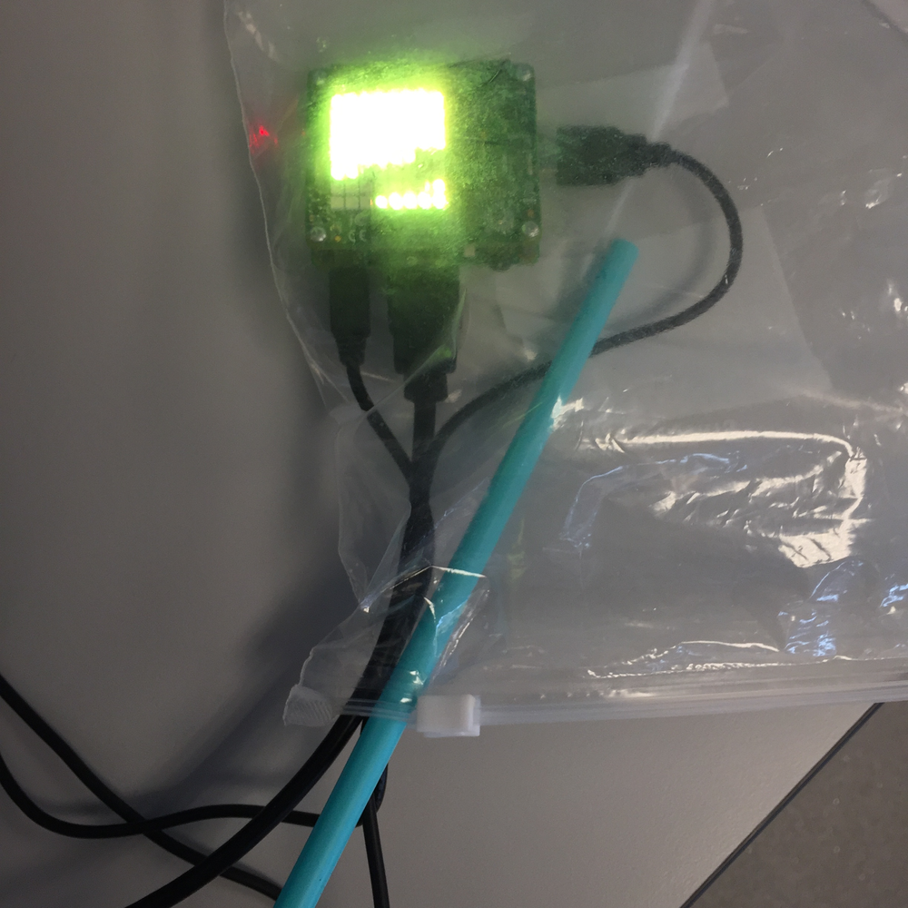
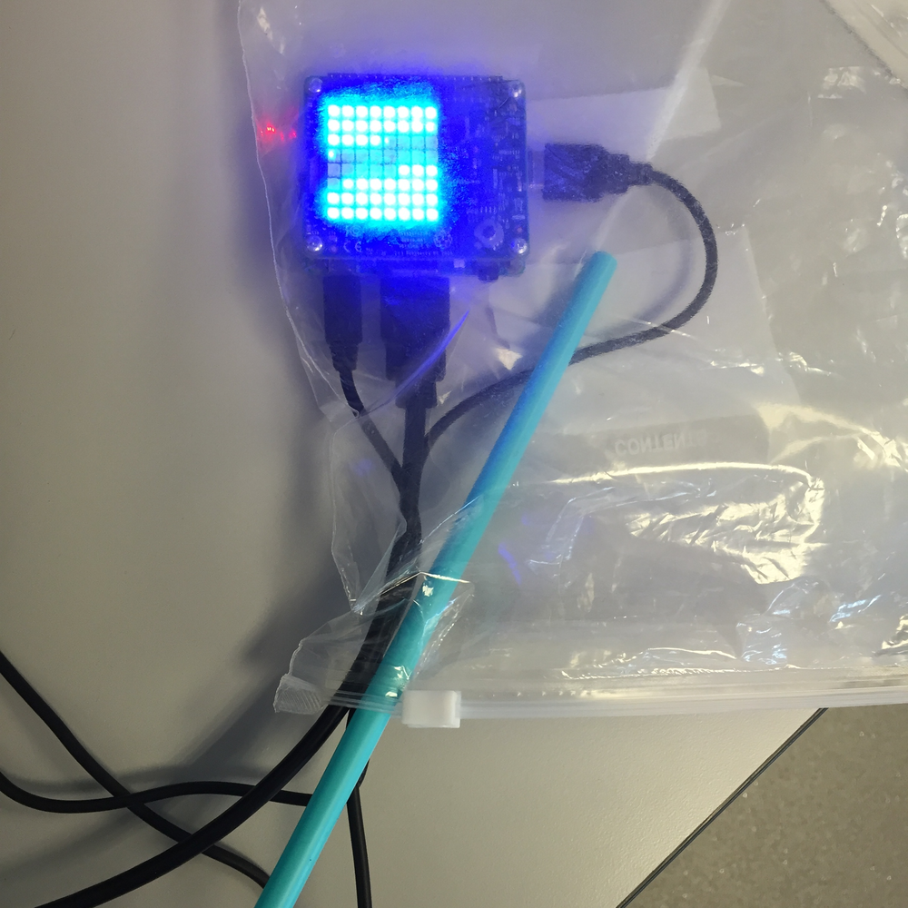

#Investigating Aerobic Respiration with the Sense HAT

In this lesson, students will investigate the products of aerobic respiration by measuring temperature and humidity.

##Learning objectives

- Understand that during aerobic respiration the stored energy in food is released in a chemical reaction.
- Understand that the products of aerobic respiration are carbon dioxide, water, and energy

##All students are able to

- Measure the temperature and humidity of exhaled air before and after exercise
- Identify that food is required to give us energy and that energy is released during respiration

##Most students are able to

- Predict how the temperature and humidity will change during the exercise
- Calculate the change in temperature and humidity
- Describe the chemical reaction which takes place during aerobic respiration

##Some students are able to

- Explain why the temperature and humidity changed during the exercise
- Link the duration of exercise to the change in temperature and humidity and explain in terms of aerobic respiration

##Lesson Summary

- Students will start the lesson by recapping the seven life processes of living things
- Students will recap on the equation for aerobic respiration
- Students will carry out an experiment to find out how the temperature and humidity of exhaled breath changes with exercise

##Starter

- Ask students to make a list of the seven life processes of all living things. 
- Ask students where their energy comes from to carry out these life processes
- Recap on the equation for aerobic respiration

##The Data Logger

- To access the resources for this investigation, open a LXTerminal and type:

From LXTerminal type: `sudo python3 respiration.py`


##Measuring the temperature and humidity change

1. Explain to students that the Sense Hat contains sensors that can measure temperature and humidity.  We could simply blow onto the sensor before and after doing exercise to measure the changes but this could produce unreliable results.


1. Setup the apparatus to measure the temperature and humidity.  You will need a large zip-lock sandwich bag and a clean and new drinking straw, the jumbo ones from IKEA work well. Ensure that the sandwich bag is dry. Place the Raspberry Pi with Sense Hat into the sandwich bag. Zip the sandwich bag as close as you can get it but still allowing room for the power, keyboard and HDMI cables. Place a drinking straw into the bag next to the cables.

##Carrying out the experiment

1. Select a student to carry out the exercise.  If you plan on repeating the experiment several times please ensure you use a clean and dry bag and straw each time. Ensure you have enough room for the student to jog on the spot for 10 seconds.

1. Once the student is ready press the button on the Sense Hat.

- The LED matrix will turn blue

- Blow into the straw until it turns yellow

- Jump on the spot 
- As soon as the LED turns blue again blow into the straw until it goes off

##Analysis of the results

- The students will be shown the humidity and temperature at the start of the experiment before doing any exercise.
- The humidity and temperature will then be displayed again after the exercise.
- Students will be able to calculate the change in temperature and humidity during the experiment
- Due to sealing the Raspberry Pi inside a sandwich bag it is possible to produce humidity results over 100%.  These results can still be used to calculate the relative humidity change.

##Plenary

Ask students to present their findings to the class.  What did they notice as they carried out the exercise to the temperature and humidity of their exhaled breath? If more than one group in the class carried out the experiment did they get the same results?

##Extension

- Students can explore ways of making the results more reliable.
- Students can plan an experiment to measure the respiration of other living things such as plants (use a large bag) or maggots. 

##Risk assessment

In addition to the points below a full risk assessment should be carried out by institution using this experiment.

- When choosing a student it is important to ensure that they are physically fit and usually engage in PE activities.
- Ensure that there is plenty of room for the students to carry out the exercise without bumping into other students.
- A fresh straw should be used for each experiment.
- The humidity of the bag will cause moisture to form inside the sandwich bags.  To avoid any risk of damage to the Raspberry Pi or to prevent electric shocks the Pi should be removed from the bag as soon as the experiment is completed.
